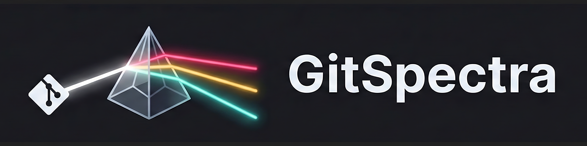

<div align="center">
  
  
  <br>
  
  [](https://www.gnu.org/licenses/agpl-3.0)
  [](https://marketplace.visualstudio.com/items?itemName=gitspectra.gitspectra)
  
  **Local-First Repo Intelligence. See the full spectrum of your Git.**
</div>

---

## The Problem

You're deep in flow, coding a critical feature. Two hours later, you push—only to discover your teammate already changed the same lines you did. The merge fails. Now you have to:

1. Understand their changes
2. Understand how your changes interact
3. Manually resolve conflicts
4. Re-test everything

**This is preventable.**

## The Solution

GitSpectra warns you **before you commit** that someone else has changed lines you're working on.

```
  1 │    import React from 'react';
  2 │    
🔴 3 │    export function Header() {     ← ⚠️ Bob changed this line 2h ago
🔴 4 │      const [open, setOpen] = useState(false);
  5 │      ...
```

No more blind coding. No more merge surprises.

---

## ✨ Features

### 🎯 Real-Time Conflict Detection
See conflicts as you type—not when you try to merge.

### 🔒 100% Local & Private
- **Zero cloud dependencies** — works entirely on your machine
- **No telemetry** — your code never leaves your computer
- **No accounts required** — uses your existing Git credentials
- **Enterprise-ready** — approved by even the strictest IT policies

### 🎛️ Configurable Scope
Large codebase? Too many PRs? Filter what matters:

```json
{
  "scope": {
    "authors": ["alice", "bob", "charlie"],  // Only my team
    "timeWindow": "14d",                      // Last 2 weeks
    "branches": ["origin/main", "origin/develop"]
  }
}
```

### 👥 Team Configuration
Commit a `.gitspectra.json` file so your whole team stays in sync.

### 🖥️ Native VS Code Integration
- Gutter icons for line-level conflicts
- Hover cards with commit details
- Status bar summary
- Dedicated Conflict Panel
- Activity Feed with team visibility

---

## 📸 Screenshots

### Gutter Indicators


### Hover Details


### Conflict Panel


---

## 🚀 Quick Start

### 1. Install

```
ext install gitspectra.gitspectra
```

Or search "GitSpectra" in VS Code Extensions.

### 2. Open a Git Repository

GitSpectra activates automatically in any Git repo.

### 3. Start Coding

That's it! Conflicts will appear in the gutter as you work.

---

## ⚙️ Configuration

### Basic Settings

In VS Code settings (`Cmd+,` / `Ctrl+,`):

| Setting | Default | Description |
|---------|---------|-------------|
| `gitspectra.fetchInterval` | `300` | Seconds between auto-fetch (0 = disabled) |
| `gitspectra.fetchOnSave` | `true` | Fetch when you save a file |
| `gitspectra.scope.branches` | `["origin/main"]` | Branches to check against |
| `gitspectra.scope.timeWindow` | `"30d"` | How far back to look |

### Team Configuration

Create `.gitspectra.json` in your repo root:

```json
{
  "$schema": "https://gitspectra.dev/schema/v1.json",
  "version": "1.0",
  
  "scope": {
    "authors": ["alice@company.com", "bob@company.com"],
    "timeWindow": "14d",
    "branches": ["origin/main", "origin/develop"],
    "excludeBranches": ["origin/dependabot/*"]
  },
  
  "team": {
    "members": [
      { "name": "Alice", "email": "alice@company.com" },
      { "name": "Bob", "email": "bob@company.com" }
    ]
  }
}
```

Commit this file so your whole team uses the same settings!

---

## 🔧 How It Works

GitSpectra uses standard Git commands to detect conflicts locally:

1. **Background Fetch**: Periodically runs `git fetch` to get latest remote state
2. **Merge Simulation**: Uses `git merge-tree` to simulate a merge *without* touching your working directory
3. **Conflict Parsing**: Parses the output to find conflicting line ranges
4. **UI Update**: Decorates your editor with conflict indicators

```
┌─────────────────────────────────────┐
│          GitSpectra Engine           │
├─────────────────────────────────────┤
│                                     │
│   git fetch origin                  │
│           ↓                         │
│   git merge-tree base target HEAD   │
│           ↓                         │
│   Parse conflict markers            │
│           ↓                         │
│   Update VS Code decorations        │
│                                     │
└─────────────────────────────────────┘
```

**Your code never leaves your machine.** All operations use the local Git CLI.

---

## 🆚 Why GitSpectra?

| Feature | Cloud-Based Tools | GitSpectra |
|---------|-------------------|------------|
| 💰 Free | Freemium | 100% Free (AGPL v3) |
| 🔒 Works offline | ❌ | ✅ |
| 🏢 Enterprise-ready | ⚠️ Requires cloud | ✅ No cloud needed |
| 🔐 Data privacy | Cloud-based | Local only |
| 🎛️ Configurable scope | Limited | Full control |
| 📁 Team config file | ❌ | ✅ |

**GitSpectra is built for teams that need privacy**, work in regulated industries, or want async conflict detection without the complexity of cloud dependencies.

---

## 📋 Commands

| Command | Description |
|---------|-------------|
| `GitSpectra: Check Now` | Manually trigger conflict check |
| `GitSpectra: Show Panel` | Open the Conflict Panel |
| `GitSpectra: Configure` | Open settings |
| `GitSpectra: Dismiss All` | Clear all conflict indicators |

---

## 🐛 Troubleshooting

### "No conflicts detected" but I know there should be

1. Check if `git fetch` succeeded: Run `git fetch origin` manually
2. Verify your branch is configured: Check `gitspectra.scope.branches`
3. Check time window: Old commits may be outside `scope.timeWindow`

### Extension seems slow

1. Reduce fetch frequency: Set `fetchInterval` higher
2. Narrow scope: Add `scope.authors` or `scope.excludeBranches`
3. Check Git performance: Large repos may need `git gc`

### Conflicts not updating after teammate pushes

GitSpectra only knows about remote changes after `git fetch`. Either:
- Wait for auto-fetch (default: 5 minutes)
- Run `GitSpectra: Check Now`
- Enable `fetchOnSave`

---

## 🤝 Contributing

We welcome contributions! See [CONTRIBUTING.md](CONTRIBUTING.md) for guidelines.

### Development Setup

```bash
git clone https://github.com/KenKaminsky/gitspectra.git
cd gitspectra
npm install
npm run watch
# Press F5 in VS Code to launch extension host
```

### Running Tests

```bash
npm test
```

---

## 📜 License

This project is licensed under the **GNU Affero General Public License v3.0** (AGPL-3.0).

This means:
- ✅ You can use, modify, and distribute this software
- ✅ You can use it commercially
- ⚠️ Any modifications must also be open source under AGPL-3.0
- ⚠️ If you run a modified version as a network service, you must share your source code

See [LICENSE](LICENSE) for the full license text.

### Commercial Licensing

Need to use GitSpectra in a proprietary product? Contact us for commercial licensing options.

---

## 🙏 Acknowledgments

- Built with [VS Code Extension API](https://code.visualstudio.com/api)
- Inspired by the gap left by cloud-dependent tools
- Thanks to the open source community

---

## 📣 Feedback

- 🐛 [Report a bug](https://github.com/KenKaminsky/gitspectra/issues/new?template=bug_report.md)
- 💡 [Request a feature](https://github.com/KenKaminsky/gitspectra/issues/new?template=feature_request.md)
- 💬 [Join the discussion](https://github.com/KenKaminsky/gitspectra/discussions)

---

<p align="center">
  <strong>Stop merging blind. Start coding with confidence.</strong>
  <br><br>
  <a href="https://marketplace.visualstudio.com/items?itemName=gitspectra.gitspectra">
    Install GitSpectra →
  </a>
</p>
